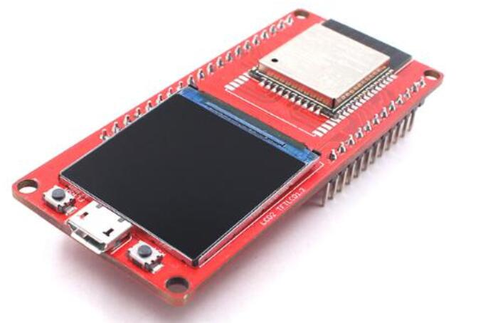
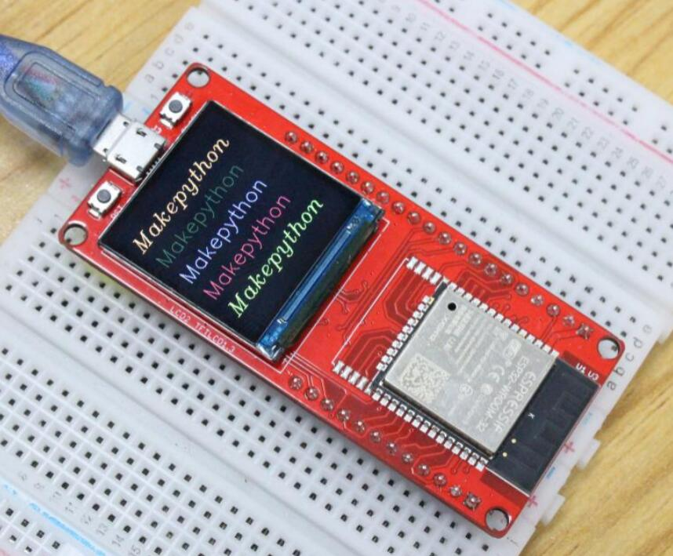
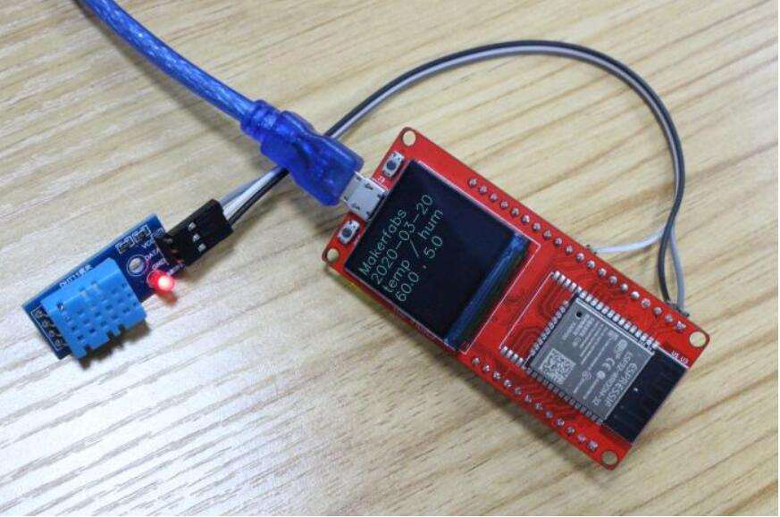
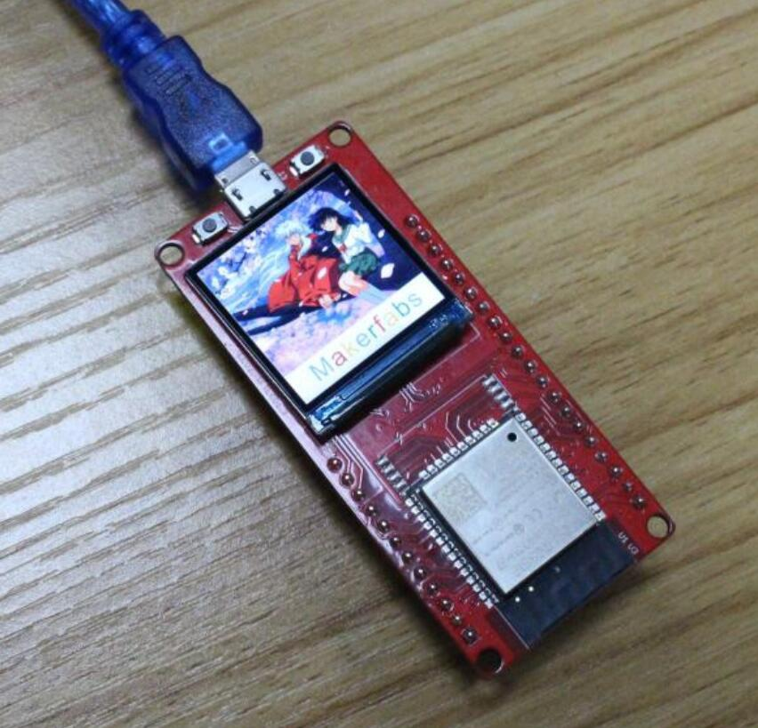

# MakePython-ESP32-Color-LCD

```c++
/*
Version:		V2.0
Author:			UNKOWN
Create Date:	UNKOWN
Note:
	2020/7/24	v2.0: Rebuid readme,add pic. By Vincent
*/
```

[toc]

# Introduce

Python is one of the most widely used, simple and easy-to-learn programming languages around. MicroPython is a lean implementation of the Python 3 programming language that has been pared down to run efficiently on microcontrollers.
Makerfabs MakePython ESP32 color LED is development board for IOT applications. Based on ESP32, the boards can act as WIFI node easily; there on-board UART-USB convertors to enable this module to be programmed anytime with a PC. 1.3-inch LCD display screen is suitable for the applications that need colorful displays.
MakePython ESP32 color LED is preloaded with MicroPython, simple and suitable for beginners to learn the basic programming with MicroPython, Of course, users can free to change it to make it work with other platforms such as Arduino/GCC.



- You can get one from: [Makepython-Esp32-Color-Lcd](https://www.makerfabs.com/makepython-esp32-color-lcd.html)

- Hardware and detailed instructions please visit Wiki page: [Makepython-Esp32-Color-Lcd Wiki](https://wiki.makerfabs.com/MaESP_ESP32_Color_LCD.html)

# Related Test

Visit the wiki for details.

- Display color words.



- Get network time and display temperature and humidity.



- Display color pictures.

-
